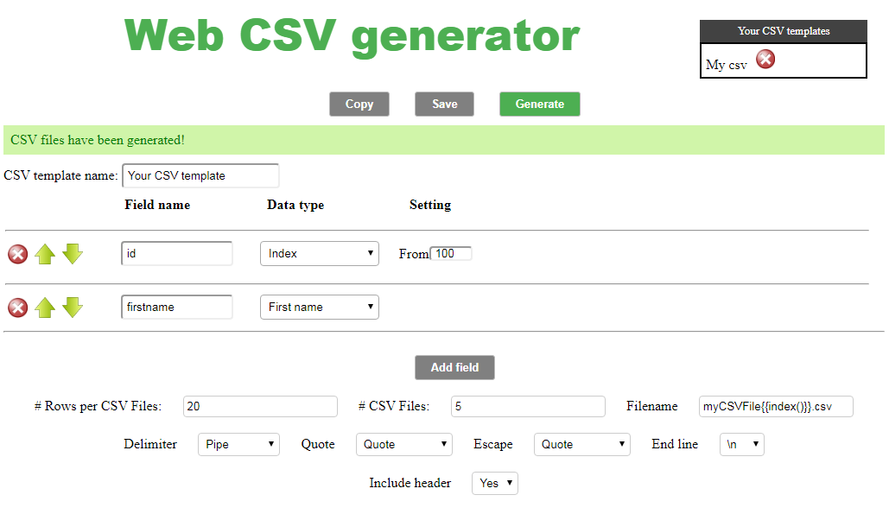

# Web CSV Generator

Web CSV Generator is a web-based random CSV data generator written in JavaScript.
It allows to generate CSV files.

Try the demo here: [https://extendsclass.com/csv-generator.html](https://extendsclass.com/csv-generator.html)

## Dependencies 

This tool uses:
 * [CodeMirror](https://github.com/codemirror/CodeMirror) (MIT license)
 * [Zip.js](https://gildas-lormeau.github.io/zip.js/) (BSD license)
 * [Papa Parse](https://github.com/mholt/PapaParse) (MIT license)
 * [Random name](https://github.com/dominictarr/random-name) (MIT license)
 * [Countries.json](https://gist.github.com/keeguon/2310008) (?)
 * [Geodata](https://github.com/mahemoff/geodata) (MIT license)

 ## Install

Drop the files into a directory (on a server or on your PC) and then visit in a browser. 

Note for Chrome: 
This tool uses zip.js which uses web workers and Chrome does not allow loading web workers when running scripts from a local file.
When you launch Chrome you must use the --allow-file-access-from-files flag.
You can also use a http server.

## Launch tests

No implemented yet.

## License

MIT
